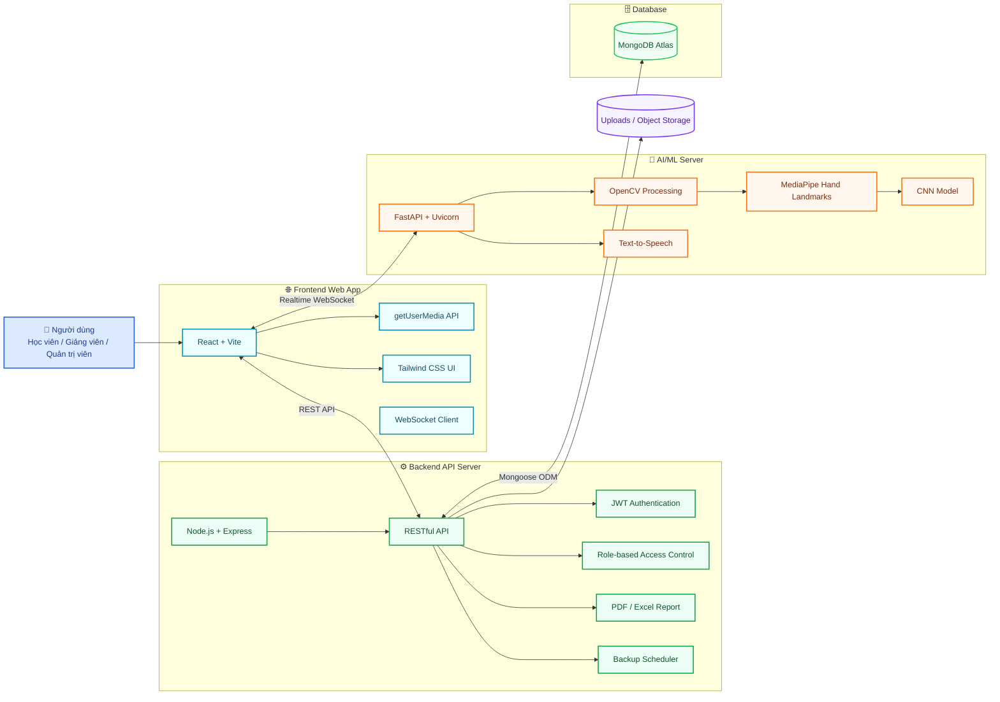
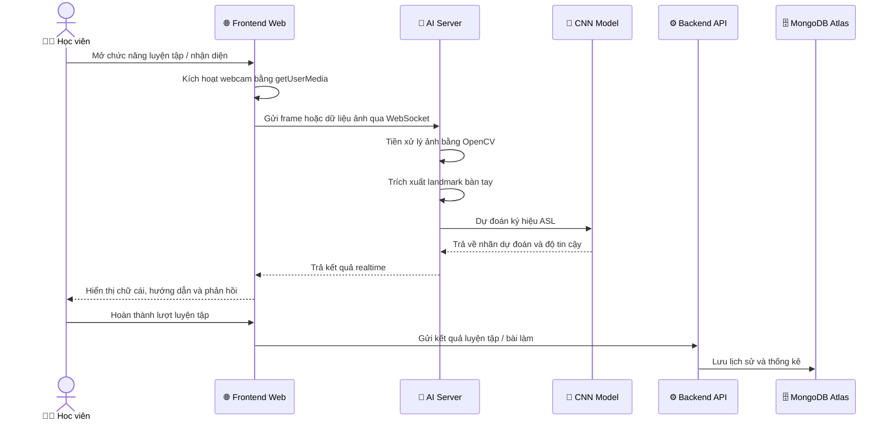
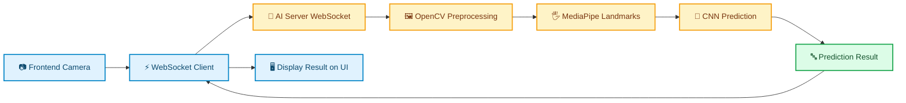
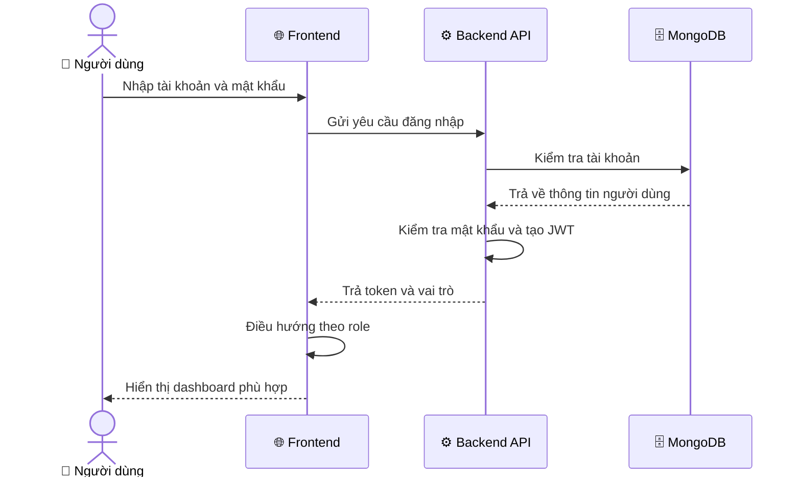
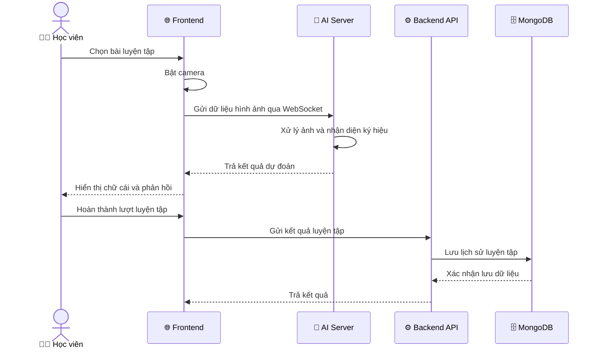
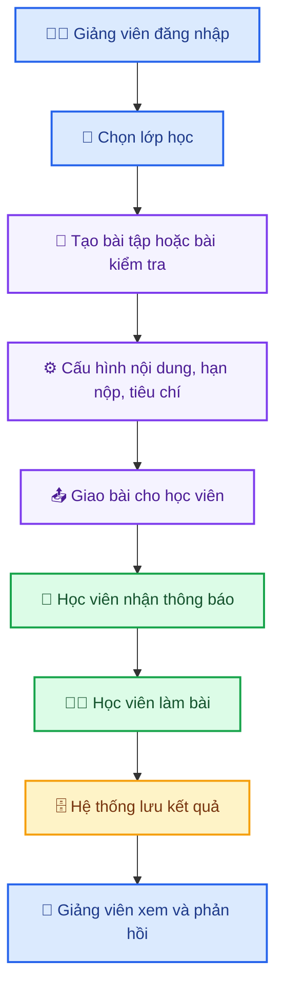
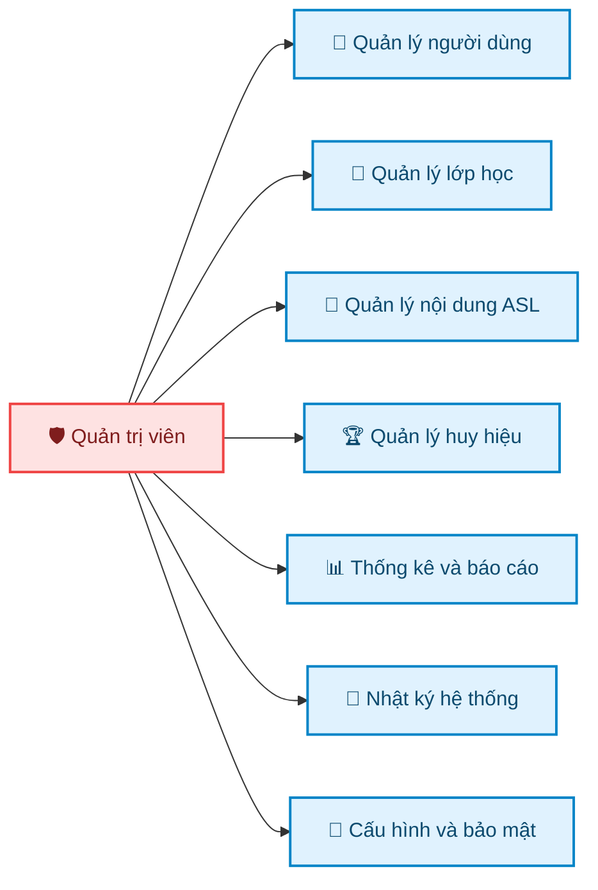

<div align="center">


# 🤟 HỆ THỐNG NHẬN DIỆN THỦ NGỮ ASL THEO THỜI GIAN THỰC

### Realtime ASL Sign Recognition & Learning Management System

**Nền tảng hỗ trợ luyện tập, kiểm tra và quản lý học tập ngôn ngữ ký hiệu ASL thông qua trí tuệ nhân tạo, thị giác máy tính và nhận diện thời gian thực.**

<br/>


<br/>


<br/>

<table>
  <tr>
    <td align="center"><b>🌐 Frontend</b><br/>React + Vite + Tailwind CSS</td>
    <td align="center"><b>⚙️ Backend</b><br/>Node.js + Express + MongoDB</td>
    <td align="center"><b>🤖 AI/ML</b><br/>FastAPI + OpenCV + MediaPipe + CNN</td>
    <td align="center"><b>⚡ Realtime</b><br/>WebSocket</td>
    <td align="center"><b>🗄️ Database</b><br/>MongoDB Atlas</td>
  </tr>
</table>

</div>

---

## 🪪 Thông tin đồ án

<table>
  <tr>
    <td width="50%" valign="top">

### 👨‍💻 Sinh viên thực hiện

| Thông tin  | Nội dung        |
| ---------- | --------------- |
| **Họ tên** | Trần Trung Phúc |
| **MSSV**   | 110122142       |
| **Lớp**    | DA22TTB         |

</td>
<td width="50%" valign="top">

### 🎓 Giảng viên hướng dẫn & đơn vị

| Thông tin               | Nội dung                    |
| ----------------------- | --------------------------- |
| **Giảng viên**          | ThS. Nguyễn Hoàng Duy Thiện |
| **Trường**              | Đại học Trà Vinh            |
| **Khoa**                | Công nghệ thông tin         |
| **Thời gian thực hiện** | 20/04/2026 – 28/06/2026     |

</td>
  </tr>
</table>

---

## ✨ Điểm nổi bật của hệ thống

| 🧠 AI Recognition                      | ⚡ Realtime Processing                                  | 📚 LMS Platform                                     | 🛡️ Role-based System                                 |
| -------------------------------------- | ------------------------------------------------------ | --------------------------------------------------- | ----------------------------------------------------- |
| Nhận diện ký hiệu ASL thông qua webcam | Xử lý dữ liệu camera theo thời gian thực qua WebSocket | Tích hợp học tập, bài tập, bài kiểm tra và thống kê | Hỗ trợ 3 vai trò: Học viên, Giảng viên, Quản trị viên |

| 🎯 Practice Feedback                                | 🏆 Gamification                | 📊 Reports                            | 🔐 Security                                 |
| --------------------------------------------------- | ------------------------------ | ------------------------------------- | ------------------------------------------- |
| Phản hồi lỗi thao tác tay trong quá trình luyện tập | Huy hiệu và thành tích học tập | Báo cáo, thống kê và theo dõi tiến độ | JWT, bcrypt, phân quyền và nhật ký hệ thống |

---

## 📖 Mục lục

* [1. Giới thiệu dự án](#gioi-thieu-du-an)
* [2. Bối cảnh và vấn đề đặt ra](#boi-canh-va-van-de-dat-ra)
* [3. Mục tiêu hệ thống](#muc-tieu-he-thong)
* [4. Đối tượng sử dụng](#doi-tuong-su-dung)
* [5. Tính năng chính](#tinh-nang-chinh)
* [6. Kiến trúc tổng quan](#kien-truc-tong-quan)
* [7. Công nghệ sử dụng](#cong-nghe-su-dung)
* [8. Cấu trúc thư mục dự án](#cau-truc-thu-muc-du-an)
* [9. Yêu cầu môi trường](#yeu-cau-moi-truong)
* [10. Hướng dẫn cài đặt và chạy hệ thống](#huong-dan-cai-dat-va-chay-he-thong)
* [11. Cấu hình biến môi trường](#cau-hinh-bien-moi-truong)
* [12. Tài liệu API và WebSocket](#tai-lieu-api-va-websocket)
* [13. Luồng hoạt động chính](#luong-hoat-dong-chinh)
* [14. Kết quả đạt được](#ket-qua-dat-duoc)
* [15. Định hướng phát triển](#dinh-huong-phat-trien)
* [16. Tài liệu liên quan](#tai-lieu-lien-quan)

---

<a id="gioi-thieu-du-an"></a>

## 📌 1. Giới thiệu dự án

**Hệ thống nhận diện thủ ngữ ASL theo thời gian thực** là một nền tảng web kết hợp giữa **trí tuệ nhân tạo**, **thị giác máy tính** và **hệ thống quản lý học tập LMS** nhằm hỗ trợ người học luyện tập ngôn ngữ ký hiệu ASL một cách trực quan, chủ động và có phản hồi tức thời.

Hệ thống sử dụng camera/webcam để thu nhận hình ảnh bàn tay của người dùng, sau đó xử lý thông qua AI Server để nhận diện ký hiệu tay ASL. Kết quả nhận diện được hiển thị dưới dạng văn bản, đồng thời hỗ trợ phát âm thanh thông qua chức năng chuyển đổi văn bản thành giọng nói.

Bên cạnh chức năng nhận diện thời gian thực, hệ thống còn được mở rộng thành một nền tảng học tập với ba nhóm vai trò chính:

| Vai trò               | Mục đích sử dụng                                                                        |
| --------------------- | --------------------------------------------------------------------------------------- |
| **👨‍🎓 Học viên**    | Luyện tập ký hiệu ASL, làm bài tập, bài kiểm tra, xem phản hồi và theo dõi tiến độ      |
| **👨‍🏫 Giảng viên**  | Quản lý lớp học, giao bài, theo dõi học viên, chấm điểm và phản hồi                     |
| **🛡️ Quản trị viên** | Quản lý người dùng, lớp học, nội dung, huy hiệu, thống kê, nhật ký và cấu hình hệ thống |

---

<a id="boi-canh-va-van-de-dat-ra"></a>

## 🧩 2. Bối cảnh và vấn đề đặt ra

Trong thực tế, cộng đồng người khiếm thính và khiếm ngôn thường gặp nhiều rào cản trong giao tiếp với người không biết ngôn ngữ ký hiệu. Đối với người mới học ASL, việc luyện tập cũng gặp nhiều khó khăn do thiếu công cụ phản hồi tức thời, thiếu môi trường tự học và phụ thuộc nhiều vào sự hướng dẫn trực tiếp của giảng viên.

Một số vấn đề chính mà hệ thống hướng đến giải quyết:

| Vấn đề                               | Tác động                                    | Hướng giải quyết của hệ thống                          |
| ------------------------------------ | ------------------------------------------- | ------------------------------------------------------ |
| **Thiếu phản hồi khi tự luyện tập**  | Người học khó biết mình ký đúng hay sai     | Cung cấp phản hồi realtime thông qua AI                |
| **Khó theo dõi tiến độ học tập**     | Giảng viên khó đánh giá quá trình luyện tập | Lưu lịch sử, thống kê, điểm số và kết quả bài làm      |
| **Rào cản giao tiếp**                | Người không biết ASL khó hiểu ký hiệu tay   | Chuyển ký hiệu thành văn bản và giọng nói              |
| **Thiếu hệ thống học tập tập trung** | Khó tổ chức lớp, bài tập, bài kiểm tra      | Tích hợp LMS cho học viên, giảng viên và quản trị viên |

---

<a id="muc-tieu-he-thong"></a>

## 🎯 3. Mục tiêu hệ thống

### 3.1. Mục tiêu tổng quát

Xây dựng một hệ thống web hoàn chỉnh có khả năng nhận diện ký hiệu ASL theo thời gian thực thông qua camera, đồng thời tích hợp các chức năng quản lý học tập nhằm hỗ trợ quá trình giảng dạy, luyện tập và đánh giá người học.

### 3.2. Mục tiêu cụ thể

| Nhóm mục tiêu               | Nội dung                                                                                   |
| --------------------------- | ------------------------------------------------------------------------------------------ |
| **🤖 Mục tiêu AI**          | Nhận diện ký hiệu tay ASL thông qua mô hình học sâu và các điểm mốc bàn tay                |
| **⚡ Mục tiêu realtime**     | Truyền dữ liệu camera đến AI Server qua WebSocket và nhận kết quả dự đoán nhanh            |
| **📚 Mục tiêu học tập**     | Hỗ trợ học viên luyện tập, kiểm tra nhanh, làm bài tập và theo dõi kết quả                 |
| **🧑‍🏫 Mục tiêu quản lý**  | Hỗ trợ giảng viên và quản trị viên quản lý lớp học, nội dung, báo cáo và người dùng        |
| **🎨 Mục tiêu trải nghiệm** | Thiết kế giao diện trực quan, dễ dùng, phù hợp với người học ASL                           |
| **🚀 Mục tiêu mở rộng**     | Tạo nền tảng có thể phát triển thêm nhận diện từ vựng, câu giao tiếp và triển khai thực tế |

---

<a id="doi-tuong-su-dung"></a>

## 👥 4. Đối tượng sử dụng

| Đối tượng                 | Mô tả                                     | Nhu cầu chính                                               |
| ------------------------- | ----------------------------------------- | ----------------------------------------------------------- |
| **👨‍🎓 Học viên**        | Người học hoặc người mới làm quen với ASL | Luyện tập ký hiệu, kiểm tra, xem phản hồi, theo dõi tiến độ |
| **👨‍🏫 Giảng viên**      | Người giảng dạy ASL hoặc quản lý lớp học  | Giao bài, chấm điểm, theo dõi học viên, gửi phản hồi        |
| **🛡️ Quản trị viên**     | Người vận hành hệ thống                   | Quản lý tài khoản, lớp học, nội dung, báo cáo, bảo mật      |
| **🤝 Người quan tâm ASL** | Người muốn học ASL để giao tiếp cơ bản    | Tự luyện tập và làm quen với ký hiệu tay                    |

---

<a id="tinh-nang-chinh"></a>

## ✨ 5. Tính năng chính

### 5.1. Tổng quan tính năng

| Nhóm chức năng                 | Mô tả                                                                    |
| ------------------------------ | ------------------------------------------------------------------------ |
| **🤟 Nhận diện ASL realtime**  | Nhận diện ký hiệu tay thông qua webcam và AI Server                      |
| **📘 Luyện tập ký hiệu**       | Hỗ trợ luyện tập chữ cái, từ vựng, câu giao tiếp và luyện tập tổng hợp   |
| **🎯 Phản hồi sửa lỗi**        | Gợi ý điều chỉnh thao tác tay khi người học thực hiện sai                |
| **📝 Bài tập và bài kiểm tra** | Cho phép học viên làm bài, nộp bài và nhận điểm/nhận xét                 |
| **🏫 Quản lý lớp học**         | Giảng viên quản lý học viên, bài tập, bài kiểm tra và tiến độ            |
| **🛠️ Quản trị hệ thống**      | Quản lý người dùng, phân quyền, nhật ký, báo cáo và cấu hình             |
| **🏆 Huy hiệu thành tích**     | Khuyến khích học viên luyện tập thông qua hệ thống thành tích            |
| **💬 Nhắn tin và thông báo**   | Hỗ trợ trao đổi giữa học viên, giảng viên và hệ thống                    |
| **📊 Báo cáo thống kê**        | Xuất và theo dõi dữ liệu học tập, điểm số, tiến độ và hoạt động hệ thống |

---

### 5.2. Tính năng theo vai trò

#### 👨‍🎓 Học viên

| Chức năng               | Mô tả                                                     |
| ----------------------- | --------------------------------------------------------- |
| Đăng ký / đăng nhập     | Tạo tài khoản học viên và truy cập hệ thống               |
| Trang chủ học viên      | Xem tổng quan tiến độ, thông báo, bài tập và bài kiểm tra |
| Nhận diện tự do         | Thực hành ký hiệu ASL không ràng buộc bài học             |
| Luyện tập chữ cái       | Luyện tập từng chữ cái ASL                                |
| Luyện tập từ vựng       | Ghép nhiều ký hiệu thành từ                               |
| Luyện tập câu giao tiếp | Thực hành các câu ngắn hoặc chuỗi ký hiệu                 |
| Luyện tập trắc nghiệm   | Chọn đáp án đúng dựa trên hình ảnh hoặc ký hiệu           |
| Luyện tập tổng hợp      | Kết hợp nhiều dạng bài luyện tập                          |
| Làm bài tập             | Thực hiện bài tập được giảng viên giao                    |
| Làm bài kiểm tra        | Thực hiện bài kiểm tra có tính điểm                       |
| Xem phản hồi            | Nhận nhận xét từ giảng viên                               |
| Huy hiệu                | Xem thành tích và huy hiệu đạt được                       |
| Tin nhắn                | Trao đổi với giảng viên                                   |
| Hỗ trợ kỹ thuật         | Gửi yêu cầu hỗ trợ khi gặp sự cố                          |

---

#### 👨‍🏫 Giảng viên

| Chức năng            | Mô tả                                                  |
| -------------------- | ------------------------------------------------------ |
| Tổng quan giảng viên | Theo dõi lớp học, học viên, bài tập và thống kê        |
| Quản lý học viên     | Xem danh sách, thông tin và tiến độ học viên           |
| Quản lý bài tập      | Tạo, chỉnh sửa, giao và theo dõi bài tập               |
| Quản lý bài kiểm tra | Tạo đề kiểm tra, cấu hình nội dung và theo dõi kết quả |
| Chấm điểm            | Chấm bài, ghi nhận xét và phản hồi cho học viên        |
| Báo cáo thống kê     | Xem dữ liệu học tập của lớp và từng học viên           |
| Quản lý huy hiệu     | Trao hoặc thu hồi huy hiệu theo kết quả học tập        |
| Quản lý nhận xét     | Theo dõi và phản hồi quá trình học tập                 |
| Tin nhắn             | Trao đổi trực tiếp với học viên                        |
| Thông báo            | Gửi thông báo lớp học hoặc nhắc nhở                    |
| Hỗ trợ kỹ thuật      | Theo dõi và phản hồi yêu cầu hỗ trợ                    |

---

#### 🛡️ Quản trị viên

| Chức năng              | Mô tả                                                            |
| ---------------------- | ---------------------------------------------------------------- |
| Tổng quan quản trị     | Xem thống kê toàn hệ thống                                       |
| Quản lý học viên       | Thêm, sửa, khóa, mở khóa và theo dõi tài khoản học viên          |
| Quản lý giảng viên     | Quản lý tài khoản và phân công giảng viên                        |
| Quản lý lớp học        | Tạo lớp, phân công giảng viên và quản lý danh sách học viên      |
| Ngân hàng câu hỏi      | Quản lý câu hỏi phục vụ bài tập, bài kiểm tra và trắc nghiệm     |
| Quản lý nội dung ASL   | Quản lý chữ cái, từ vựng, câu và tài nguyên học tập              |
| Thống kê và phân tích  | Theo dõi số liệu hoạt động, tiến độ học tập và dữ liệu hệ thống  |
| Báo cáo                | Xuất báo cáo phục vụ quản lý                                     |
| Thông báo hệ thống     | Tạo và quản lý thông báo                                         |
| Nhật ký hệ thống       | Theo dõi hoạt động, sự kiện và audit log                         |
| Hệ thống và bảo mật    | Quản lý cấu hình, phiên đăng nhập, sao lưu và chính sách bảo mật |
| Phân quyền hệ thống    | Quản lý vai trò và quyền truy cập                                |
| Hỗ trợ kỹ thuật        | Tiếp nhận, phân loại và xử lý yêu cầu hỗ trợ                     |
| Huy hiệu và thành tích | Quản lý định nghĩa huy hiệu toàn hệ thống                        |

---

### 5.3. Tính năng AI và realtime

| Thành phần                      | Mô tả                                            |
| ------------------------------- | ------------------------------------------------ |
| **📷 Webcam Input**             | Thu hình ảnh bàn tay từ trình duyệt              |
| **🖐️ Hand Landmark Detection** | Phát hiện bàn tay và trích xuất điểm mốc bàn tay |
| **🧠 CNN Recognition**          | Nhận diện ký hiệu ASL dựa trên mô hình học sâu   |
| **⚡ Realtime WebSocket**        | Gửi và nhận kết quả dự đoán theo thời gian thực  |
| **🎯 Finger-level Feedback**    | Phân tích và gợi ý sửa lỗi thao tác tay          |
| **🔤 Text Output**              | Hiển thị ký hiệu nhận diện thành văn bản         |
| **🔊 Text-to-Speech**           | Đọc nội dung văn bản thành giọng nói             |

---

<a id="kien-truc-tong-quan"></a>

## 🧱 6. Kiến trúc tổng quan

Hệ thống được tổ chức theo hướng tách thành nhiều thành phần độc lập, trong đó mỗi service đảm nhiệm một vai trò riêng:

| Thành phần                      | Vai trò                                                                 |
| ------------------------------- | ----------------------------------------------------------------------- |
| **🌐 Frontend Web**             | Giao diện người dùng, camera, hiển thị kết quả, điều hướng theo vai trò |
| **⚙️ Backend API Server**       | Xử lý nghiệp vụ, xác thực, phân quyền, quản lý dữ liệu                  |
| **🤖 AI/ML Server**             | Nhận diện ASL, xử lý ảnh, phân tích realtime                            |
| **🗄️ MongoDB Atlas**           | Lưu trữ người dùng, lớp học, bài tập, bài kiểm tra, huy hiệu, thông báo |
| **📦 Object Storage / Uploads** | Lưu trữ file, ảnh đại diện, tài liệu hoặc dữ liệu upload nếu có         |
| **📊 Report / Backup Module**   | Xuất báo cáo và sao lưu dữ liệu hệ thống                                |

---

### 6.1. Sơ đồ kiến trúc hệ thống



---

### 6.2. Sơ đồ xử lý nhận diện ASL realtime



---

### 6.3. Bảng cổng dịch vụ

| Dịch vụ             | Công nghệ         | Cổng mặc định | URL                       |
| ------------------- | ----------------- | ------------: | ------------------------- |
| **🌐 Frontend Web** | React + Vite      |        `5173` | `http://localhost:5173`   |
| **⚙️ Backend API**  | Node.js + Express |        `5000` | `http://localhost:5000`   |
| **🤖 AI Server**    | FastAPI + Uvicorn |        `8000` | `http://localhost:8000`   |
| **⚡ AI WebSocket**  | WebSocket         |        `8000` | `ws://localhost:8000/...` |
| **🗄️ Database**    | MongoDB Atlas     |         Cloud | Cấu hình qua `MONGO_URI`  |

> [!IMPORTANT]
> Tên endpoint WebSocket chính xác cần đối chiếu với mã nguồn AI Server hoặc tài liệu API trong repository.

---

<a id="cong-nghe-su-dung"></a>

## 🛠️ 7. Công nghệ sử dụng

### 7.1. Tổng quan công nghệ

| Phân hệ             | Công nghệ                          | Vai trò                                    |
| ------------------- | ---------------------------------- | ------------------------------------------ |
| **Frontend**        | React, Vite, Tailwind CSS          | Xây dựng giao diện người dùng              |
| **Realtime Client** | WebSocket Client, getUserMedia API | Truy cập camera và giao tiếp realtime      |
| **HTTP Client**     | Axios                              | Gọi REST API từ frontend đến backend       |
| **Backend**         | Node.js, Express.js                | Xử lý nghiệp vụ và API                     |
| **Authentication**  | JWT, bcrypt                        | Đăng nhập, mã hóa mật khẩu, xác thực phiên |
| **Database**        | MongoDB Atlas                      | Lưu trữ dữ liệu hệ thống                   |
| **ODM**             | Mongoose                           | Làm việc với MongoDB trong Node.js         |
| **File Upload**     | Multer                             | Xử lý upload file nếu có                   |
| **Report Export**   | pdfkit, xlsx                       | Xuất báo cáo PDF/Excel                     |
| **Scheduler**       | node-cron                          | Lập lịch tác vụ tự động                    |
| **AI Server**       | Python, FastAPI, Uvicorn           | Xử lý AI và realtime service               |
| **Computer Vision** | OpenCV, MediaPipe                  | Xử lý ảnh và trích xuất landmark bàn tay   |
| **Deep Learning**   | TensorFlow/Keras, CNN              | Nhận diện ký hiệu ASL                      |
| **Text-to-Speech**  | TTS module                         | Chuyển văn bản thành giọng nói             |

---

### 7.2. Công nghệ theo tầng kiến trúc

| Tầng                    | Thành phần           | Mô tả                                             |
| ----------------------- | -------------------- | ------------------------------------------------- |
| **Presentation Layer**  | React Web App        | Cung cấp giao diện theo từng vai trò              |
| **Application Layer**   | Express API Server   | Điều phối nghiệp vụ, xác thực và phân quyền       |
| **AI Processing Layer** | FastAPI AI Server    | Xử lý nhận diện ký hiệu theo thời gian thực       |
| **Data Layer**          | MongoDB Atlas        | Lưu trữ dữ liệu người dùng, bài học, bài kiểm tra |
| **Integration Layer**   | REST API + WebSocket | Kết nối giữa giao diện, backend và AI service     |

---

<a id="cau-truc-thu-muc-du-an"></a>

## 🗂️ 8. Cấu trúc thư mục dự án

> Cấu trúc dưới đây được trình bày theo hướng tổng quan để người đọc dễ hiểu. Tên thư mục hoặc file có thể cần điều chỉnh lại theo đúng repository hiện tại nếu có thay đổi.

```bash
project-root/
│
├── ai_server/                       # AI Server xử lý nhận diện ASL realtime
│   ├── main.py                      # Điểm khởi chạy FastAPI
│   ├── requirements.txt             # Danh sách thư viện Python
│   └── ...                          # Module xử lý AI, TTS, prediction
│
├── backend_server/                  # Backend API Server
│   ├── server.js                    # Entry point của Express server
│   ├── package.json                 # Script và thư viện backend
│   ├── routes/                      # Định nghĩa các API route
│   │   ├── auth.js                  # API xác thực
│   │   ├── admin/                   # API quản trị viên
│   │   ├── instructor/              # API giảng viên
│   │   └── student/                 # API học viên
│   │
│   ├── models/                      # Mongoose schema/model
│   ├── middleware/                  # Middleware xác thực, phân quyền
│   ├── utils/                       # Hàm tiện ích
│   ├── uploads/                     # File upload
│   ├── backups/                     # Dữ liệu sao lưu
│   │
│   └── frontend_web/                # Frontend React/Vite
│       ├── package.json
│       ├── vite.config.js
│       ├── index.html
│       └── src/
│           ├── main.jsx
│           ├── App.jsx
│           ├── components/
│           ├── contexts/
│           ├── hooks/
│           ├── data/
│           └── utils/
│
├── docs/                            # Tài liệu hệ thống nếu có
├── README.md                        # Tài liệu giới thiệu repository
├── FULL_API_HT.MD                   # Tài liệu API nếu có
├── HUONG_DAN_CHAY_DU_AN.md          # Hướng dẫn chạy dự án nếu có
├── DATABASE_DICTIONARY.md           # Từ điển cơ sở dữ liệu nếu có
├── USECASE.md                       # Tài liệu Use Case nếu có
├── start-all.ps1                    # Script chạy nhanh nếu có
├── check-health.ps1                 # Script kiểm tra trạng thái nếu có
└── ...
```

---

<a id="yeu-cau-moi-truong"></a>

## ⚙️ 9. Yêu cầu môi trường

Trước khi chạy hệ thống, cần cài đặt các phần mềm sau:

| Phần mềm          | Khuyến nghị            | Mục đích                   |
| ----------------- | ---------------------- | -------------------------- |
| **Git**           | Bản mới nhất           | Clone source code          |
| **Node.js**       | 18.x LTS trở lên       | Chạy backend và frontend   |
| **npm**           | Đi kèm Node.js         | Cài đặt package JavaScript |
| **Python**        | 3.9 trở lên            | Chạy AI Server             |
| **pip**           | Bản mới nhất           | Cài đặt thư viện Python    |
| **MongoDB Atlas** | Cluster cloud          | Lưu trữ dữ liệu            |
| **Webcam**        | Bắt buộc cho nhận diện | Thu hình ảnh bàn tay       |
| **Trình duyệt**   | Chrome / Edge mới      | Chạy web app và camera     |
| **PowerShell**    | Windows                | Chạy script `.ps1` nếu có  |

---

<a id="huong-dan-cai-dat-va-chay-he-thong"></a>

## 🚀 10. Hướng dẫn cài đặt và chạy hệ thống

### 10.1. Clone repository

```bash
git clone <repository-url>
cd <repository-name>
```

Ví dụ:

```bash
git clone https://github.com/<username>/<repository-name>.git
cd <repository-name>
```

---

### 10.2. Cài đặt Backend Server

```bash
cd backend_server
npm install
```

Chạy backend:

```bash
npm start
```

Hoặc nếu trong `package.json` có script dev:

```bash
npm run dev
```

Backend mặc định chạy tại:

```bash
http://localhost:5000
```

---

### 10.3. Cài đặt Frontend Web

```bash
cd backend_server/frontend_web
npm install
```

Chạy frontend:

```bash
npm run dev
```

Frontend mặc định chạy tại:

```bash
http://localhost:5173
```

---

### 10.4. Cài đặt AI/ML Server

```bash
cd ai_server
python -m venv venv
```

Kích hoạt môi trường ảo trên Windows:

```bash
venv\Scripts\activate
```

Kích hoạt môi trường ảo trên macOS/Linux:

```bash
source venv/bin/activate
```

Cài đặt thư viện Python:

```bash
pip install -r requirements.txt
```

Chạy AI Server:

```bash
uvicorn main:app --host 127.0.0.1 --port 8000 --reload
```

AI Server mặc định chạy tại:

```bash
http://localhost:8000
```

---

### 10.5. Chạy nhanh bằng script nếu có

Nếu repository có file `start-all.ps1`, có thể chạy toàn bộ hệ thống bằng PowerShell:

```powershell
.\start-all.ps1
```

Kiểm tra trạng thái service nếu có file `check-health.ps1`:

```powershell
.\check-health.ps1
```

---

### 10.6. Trình tự chạy khuyến nghị

| Bước | Service       | Lệnh / thao tác                         |
| ---: | ------------- | --------------------------------------- |
|    1 | **Database**  | Kiểm tra MongoDB Atlas và chuỗi kết nối |
|    2 | **Backend**   | Chạy `backend_server`                   |
|    3 | **AI Server** | Chạy `ai_server`                        |
|    4 | **Frontend**  | Chạy `frontend_web`                     |
|    5 | **Browser**   | Truy cập `http://localhost:5173`        |
|    6 | **Webcam**    | Cho phép trình duyệt sử dụng camera     |

---

<a id="cau-hinh-bien-moi-truong"></a>

## 🔐 11. Cấu hình biến môi trường

### 11.1. Backend `.env`

Tạo file `.env` trong thư mục backend nếu chưa có:

```env
PORT=5000
MONGO_URI=<your_mongodb_connection_string>
JWT_SECRET=<your_jwt_secret>
CORS_ORIGIN=http://localhost:5173
```

| Biến môi trường | Ý nghĩa                           | Ví dụ                   |
| --------------- | --------------------------------- | ----------------------- |
| `PORT`          | Cổng chạy Backend API             | `5000`                  |
| `MONGO_URI`     | Chuỗi kết nối MongoDB Atlas       | `mongodb+srv://...`     |
| `JWT_SECRET`    | Khóa bí mật dùng ký JWT           | `your_secret_key`       |
| `CORS_ORIGIN`   | Domain frontend được phép gọi API | `http://localhost:5173` |

> [!CAUTION]
> Không đưa mật khẩu thật, secret thật hoặc connection string thật lên GitHub.

---

### 11.2. Frontend `.env`

Nếu frontend có sử dụng biến môi trường, tạo file `.env` trong thư mục frontend:

```env
VITE_API_URL=http://localhost:5000
VITE_AI_SERVER_URL=http://localhost:8000
VITE_AI_WS_URL=ws://localhost:8000
```

| Biến môi trường      | Ý nghĩa                 |
| -------------------- | ----------------------- |
| `VITE_API_URL`       | URL Backend API         |
| `VITE_AI_SERVER_URL` | URL AI Server           |
| `VITE_AI_WS_URL`     | URL WebSocket AI Server |


---

### 11.3. AI Server `.env`

Nếu AI Server có hỗ trợ `.env`, có thể cấu hình:

```env
AI_HOST=127.0.0.1
AI_PORT=8000
MODEL_PATH=../cnn8grps_rad1_model.h5
```

| Biến môi trường | Ý nghĩa                     |
| --------------- | --------------------------- |
| `AI_HOST`       | Host chạy AI Server         |
| `AI_PORT`       | Cổng chạy AI Server         |
| `MODEL_PATH`    | Đường dẫn mô hình nhận diện |


---

<a id="tai-lieu-api-va-websocket"></a>

## 🔌 12. Tài liệu API và WebSocket

### 12.1. Tổng quan API

Hệ thống sử dụng RESTful API cho các nghiệp vụ chính như xác thực, quản lý người dùng, quản lý lớp học, bài tập, bài kiểm tra, huy hiệu, thông báo, báo cáo và nhật ký hệ thống.

| Nhóm API               | Vai trò               | Chức năng                                                |
| ---------------------- | --------------------- | -------------------------------------------------------- |
| **Authentication API** | Tất cả người dùng     | Đăng ký, đăng nhập, đăng xuất, hồ sơ, đổi mật khẩu       |
| **Student API**        | Học viên              | Bài tập, bài kiểm tra, luyện tập, lịch sử, huy hiệu      |
| **Instructor API**     | Giảng viên            | Quản lý lớp, học viên, bài tập, bài kiểm tra, phản hồi   |
| **Admin API**          | Quản trị viên         | Quản lý người dùng, nội dung, báo cáo, nhật ký, cấu hình |
| **Message API**        | Học viên / Giảng viên | Nhắn tin và trao đổi                                     |
| **AI API / WebSocket** | Frontend / AI Server  | Nhận diện realtime và xử lý ký hiệu                      |

---

### 12.2. Cách xác thực API

Các API yêu cầu đăng nhập cần gửi JWT trong header:

```http
Authorization: Bearer <access_token>
```

---

### 12.3. Tài liệu API chi tiết

Nếu repository có file tài liệu API, tham khảo tại:

```md
[FULL_API_HT.MD](./FULL_API_HT.MD)
```

Hoặc các tài liệu liên quan:

```md
[45API_CỐT_LÕI.MD](./45API_CỐT_LÕI.MD)
[HUONG_DAN_CHAY_DU_AN.md](./HUONG_DAN_CHAY_DU_AN.md)
```


---

### 12.4. WebSocket realtime

Luồng realtime được sử dụng để frontend gửi dữ liệu camera/frame ảnh đến AI Server và nhận lại kết quả nhận diện.



Dữ liệu WebSocket có thể bao gồm:

| Trường dữ liệu | Mô tả                        |
| -------------- | ---------------------------- |
| `frame`        | Ảnh hoặc frame gửi từ webcam |
| `prediction`   | Ký hiệu/chữ cái được dự đoán |
| `confidence`   | Độ tin cậy của kết quả       |
| `feedback`     | Gợi ý sửa lỗi nếu có         |
| `timestamp`    | Thời điểm xử lý              |

> Tên trường dữ liệu cần đối chiếu với mã nguồn WebSocket thực tế.

---

<a id="luong-hoat-dong-chinh"></a>

## 🔄 13. Luồng hoạt động chính

### 13.1. Luồng đăng nhập và phân quyền



---

### 13.2. Luồng luyện tập nhận diện ASL



---

### 13.3. Luồng giảng viên giao bài



---

### 13.4. Luồng quản trị hệ thống



---

<a id="ket-qua-dat-duoc"></a>

## 📈 14. Kết quả đạt được

| Nhóm kết quả              | Nội dung                                                                                         |
| ------------------------- | ------------------------------------------------------------------------------------------------ |
| **🤖 AI Recognition**     | Xây dựng được module nhận diện ký hiệu ASL theo thời gian thực                                   |
| **⚡ Realtime Processing** | Tích hợp WebSocket giữa frontend và AI Server                                                    |
| **🌐 Frontend Web**       | Hoàn thiện giao diện cho ba vai trò: học viên, giảng viên, quản trị viên                         |
| **⚙️ Backend API**        | Xây dựng hệ thống API phục vụ xác thực, quản lý học tập và quản trị                              |
| **🗄️ Database**          | Thiết kế cơ sở dữ liệu MongoDB phục vụ lưu trữ dữ liệu hệ thống                                  |
| **📚 LMS Features**       | Hỗ trợ lớp học, bài tập, bài kiểm tra, phản hồi, huy hiệu và báo cáo                             |
| **🎨 User Experience**    | Giao diện trực quan, có camera, phản hồi và thống kê học tập                                     |
| **📄 Documentation**      | Có tài liệu API, use case, mô tả cơ sở dữ liệu và hướng dẫn chạy dự án nếu repository đã bổ sung |

---

<a id="dinh-huong-phat-trien"></a>

## 🧭 15. Định hướng phát triển

| Hướng phát triển                  | Mô tả                                                                                    |
| --------------------------------- | ---------------------------------------------------------------------------------------- |
| **🤟 Mở rộng dữ liệu nhận diện**  | Bổ sung thêm từ vựng, câu giao tiếp và ký hiệu động                                      |
| **🧠 Tối ưu mô hình AI**          | Cải thiện độ chính xác, giảm độ trễ và tăng khả năng nhận diện trong điều kiện phức tạp  |
| **🖐️ Nhận diện hai tay**         | Hỗ trợ các ký hiệu cần phối hợp cả hai tay                                               |
| **♿ Cải thiện accessibility**     | Tối ưu giao diện cho người khiếm thính, người mới học và người dùng phổ thông            |
| **☁️ Triển khai production**      | Đưa hệ thống lên cloud, cấu hình domain, HTTPS, logging và monitoring                    |
| **📱 Ứng dụng di động**           | Phát triển phiên bản mobile để hỗ trợ luyện tập mọi lúc mọi nơi                          |
| **📊 Phân tích học tập nâng cao** | Bổ sung dashboard phân tích tiến độ, lỗi thường gặp và đề xuất bài luyện tập cá nhân hóa |
| **🌍 Hỗ trợ đa ngôn ngữ ký hiệu** | Nghiên cứu mở rộng sang các hệ thống ngôn ngữ ký hiệu khác                               |

---

<a id="tai-lieu-lien-quan"></a>

## 📚 16. Tài liệu liên quan

| Tài liệu                    | Mô tả                                                |
| --------------------------- | ---------------------------------------------------- |
| `FULL_API_HT.MD`            | Tài liệu đặc tả API hệ thống nếu có trong repository |
| `HUONG_DAN_CHAY_DU_AN.md`   | Hướng dẫn chạy dự án chi tiết                        |
| `FEATURES_SUMMARY.md`       | Tổng hợp chức năng hệ thống                          |
| `IMPLEMENTATION_SUMMARY.md` | Tóm tắt quá trình hiện thực hóa                      |
| `TESTING_GUIDE.md`          | Hướng dẫn kiểm thử                                   |
| `DEPLOYMENT_CHECKLIST.md`   | Checklist triển khai                                 |
| `USECASE.md`                | Tài liệu use case                                    |
| `DATABASE_DICTIONARY.md`    | Từ điển cơ sở dữ liệu                                |
| `CSDL_MÔ_TẢ.md`             | Mô tả cơ sở dữ liệu                                  |
| `ADMINISTRATOR.MD`          | Hướng dẫn dành cho quản trị viên                     |
| `USER.md`                   | Hướng dẫn dành cho người dùng                        |

---


</div>
